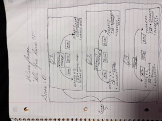

# My Project

# click-lab

## What it is
A trivia quiz with three fun facts.

## Who would use it
Someone who enjoys having random knowledge in fun fact form.

## What happens when you click
- Click the wrong answer and the default image turns into a red x indicating that the player has guessed incorrectly. A text with the word 'incorrect will display and a sound will play. The score in the score board would decrease if the wrong answer is selected.____ → ______
- Click the correct answer button and the image will change with the text giving the fun fact of that question. A sound will play and the score will increase as the player guess correctly.______ → ______

## My track
Quiz / App Lab rebuild / New idea

